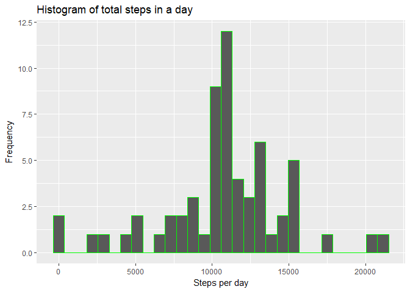

## Loading and preprocessing the data


```r
library(tidyverse)
```

```
## -- Attaching packages -------------------------------------------------------------------------------------------- tidyverse 1.2.1 --
```

```
## v ggplot2 2.2.1     v purrr   0.2.4
## v tibble  1.4.2     v dplyr   0.7.4
## v tidyr   0.8.0     v stringr 1.2.0
## v readr   1.1.1     v forcats 0.2.0
```

```
## -- Conflicts ----------------------------------------------------------------------------------------------- tidyverse_conflicts() --
## x dplyr::filter() masks stats::filter()
## x dplyr::lag()    masks stats::lag()
```

```r
dt <- read_csv("activity.zip")
```

```
## Parsed with column specification:
## cols(
##   steps = col_integer(),
##   date = col_date(format = ""),
##   interval = col_integer()
## )
```


## What is mean total number of steps taken per day?

```r
temp <- dt %>%
        group_by(date) %>%
        summarise(sum = sum(steps))

qplot(temp$sum,
      geom = "histogram",
      xlab = "Steps per day",
      ylab = "Frequency",
      main = "Histogram of steps per day", 
      col = I('green'))
```

<!-- -->

```r
summary(temp$sum)
```

```
##    Min. 1st Qu.  Median    Mean 3rd Qu.    Max.    NA's 
##      41    8841   10765   10766   13294   21194       8
```

Mean of total number of steps per day is 10766, median is 10765.

## What is the average daily activity pattern?

```r
temp <- dt %>%
        group_by(interval) %>%
        drop_na() %>%
        summarise(average = mean(steps))

qplot(temp$interval,temp$average, 
      geom = "line", 
      main="Average steps in a day", 
      xlab = "Interval", 
      ylab = "Average steps")
```

<!-- -->


```r
temp$interval[which.max(temp$average)]
```

```
## [1] 835
```


The interval with the maximum number of steps is 835

## Imputing missing values

```r
NAcount <- sum(is.na(dt$steps))
print(NAcount)
```

```
## [1] 2304
```
The number of missing values in the dataset is 2304.

## Make a histogram of the total number of steps taken each day.

```r
newdt <- dt %>%
        group_by(interval) %>%
        mutate(steps = replace(steps, is.na(steps),mean(steps,na.rm = TRUE))) %>%
        group_by(date) %>%
        summarise(sum = sum(steps))

qplot(newdt$sum, geom = "histogram",
      xlab = "Steps per day", 
      ylab = "Frequency",
      main = "Histogram of total steps in a day",
      col = I("green"))
```

<!-- -->


## Calculate and report the mean and median total number of steps taken per day. 

```r
summary(newdt$sum)
```

```
##    Min. 1st Qu.  Median    Mean 3rd Qu.    Max. 
##      41    9819   10766   10766   12811   21194
```

Finding: The Mean number of steps is 10766 and the Median is 10766. So the mean value stays the same, and the median value is slightly increased.


## Are there differences in activity patterns between weekdays and weekends?


```r
newdt <- dt %>%
        group_by(interval) %>%
        mutate(steps = replace(steps, is.na(steps),mean(steps,na.rm = TRUE))) %>%
        mutate(day = ifelse(weekdays(date) %in% c("Saturday","Sunday"), "weekend","weekday")) %>%
        group_by(interval,day) %>%
        summarise(steps = mean(steps))

ggplot(newdt,aes(x=interval,y=steps)) + 
        geom_line()+
        facet_wrap(~day,nrow = 2,ncol = 1) +
        labs(y="Number of steps")
```

<!-- -->

